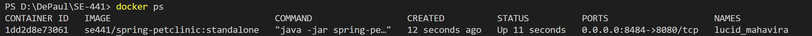
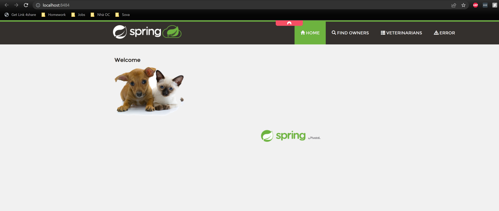
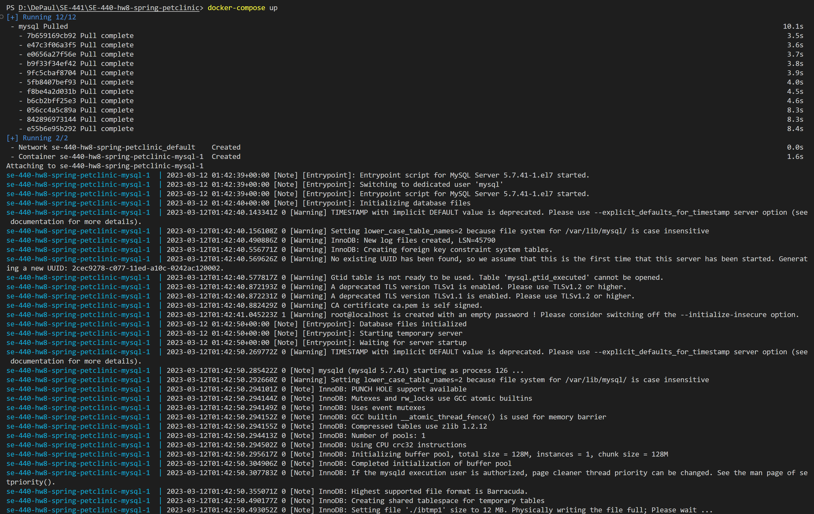
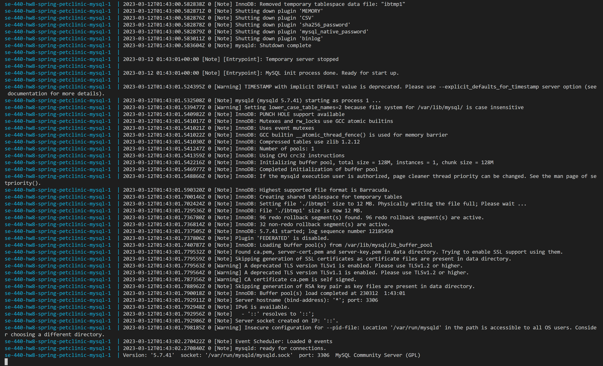
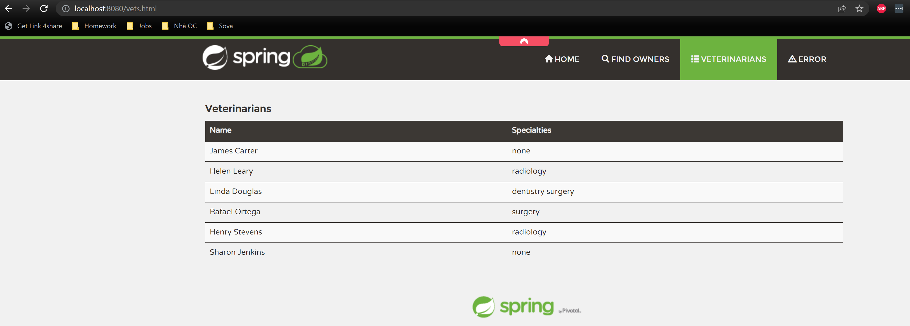
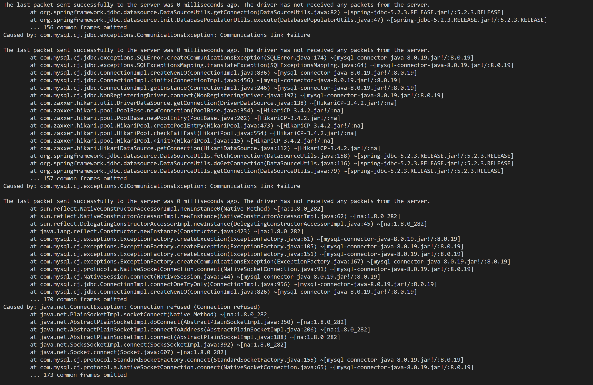
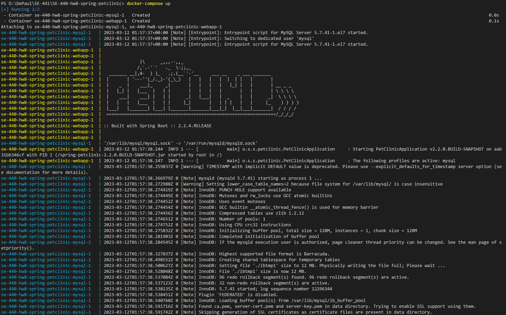
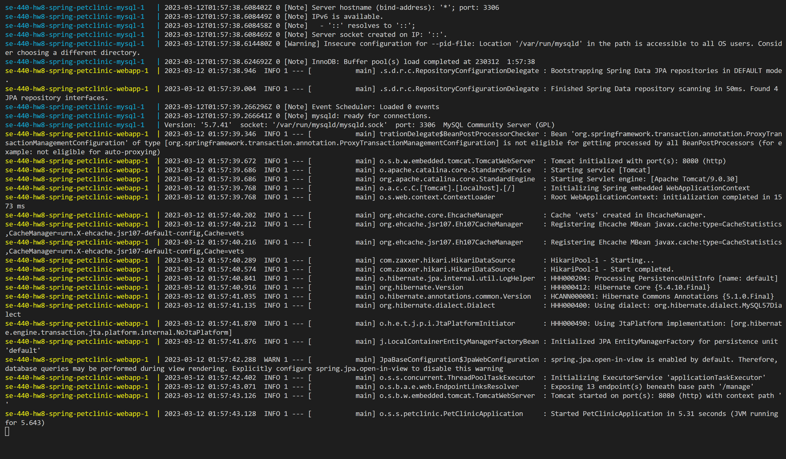
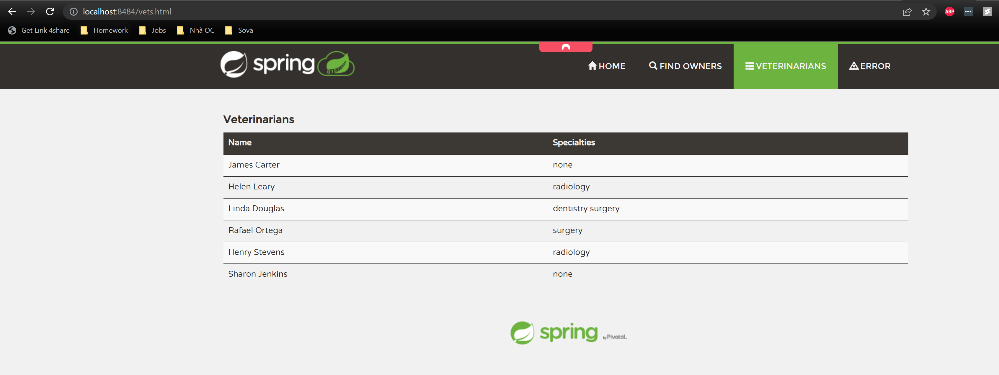

## Tan Nguyen - ID: 2072315
https://github.com/tannguyen16/SE-440-hw8-spring-petclinic

# DOCKER
1. 5 pts Your dockerfile. Please provide a link to this file rather than a screen capture.
See [Dockerfile](Dockerfile)

2. 5 pts Your running docker instance as shown by a ps command.

3. 5 pts Your browser accessing the main page of the website from your local container.

# DOCKER COMPOSE - MYSQL ONLY
4. 5 pts The output from the docker-compose up command.

5. 5 pts Your browser accessing the “Veterinarians” page of the website from your local container when you run the application from the host system.

6. 5 pts A section of the stack trace generated when you attempt to run the application container that has been updated to use MySQL.

# DOCKER COMPOSE - APP SERVER AND MYSQL
7. 5 pts Your updated docker-compose.yml file containing the application server, built from your local Dockerfile, and the existing MySQL configuration. Please provide a link to this file rather than a screen capture.
See [docker-compose.yml](docker-compose.yml)

8. 5 pts Your updated application-mysql.properties file containing the URL change for the database server. Please provide a link to this file rather than a screen capture.
See [src/main/resources/application-mysql.properties](src/main/resources/application-mysql.properties)

9. 5 pts The output from the docker-compose up command.

10. 5 pts Your browser accessing the “Veterinarians” page of the website from your local container.

