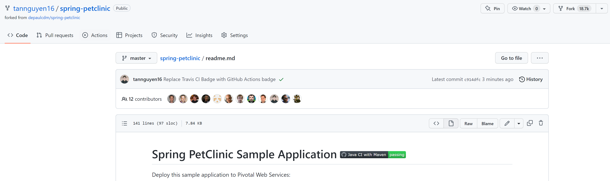
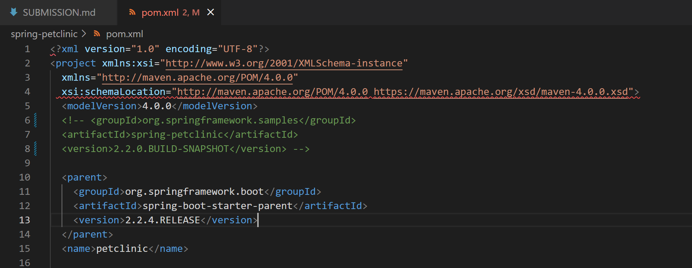
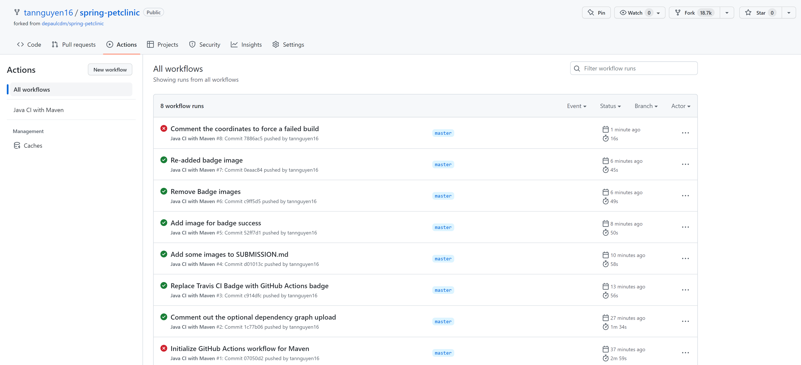
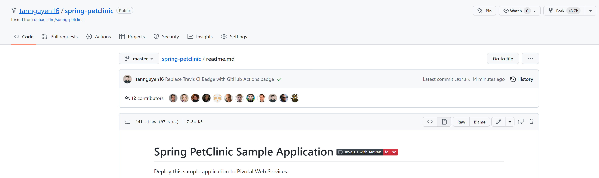
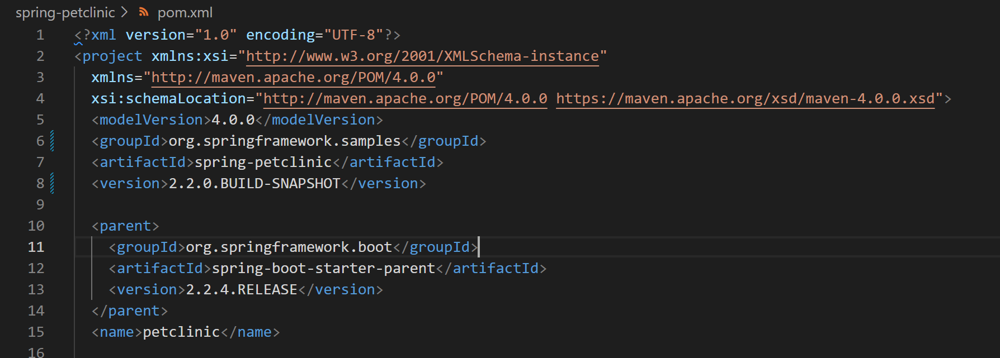
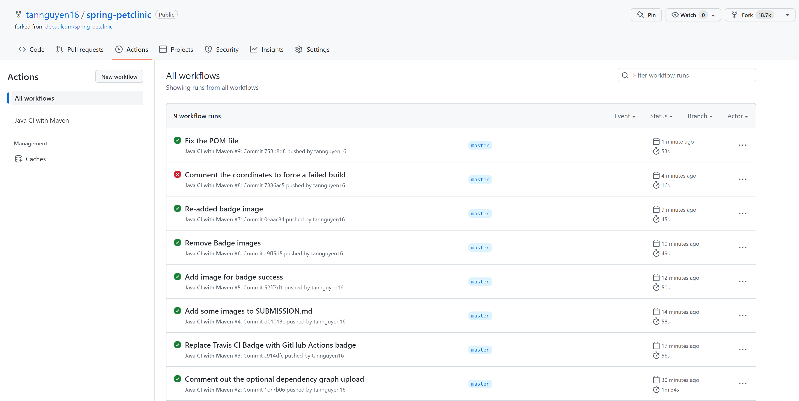

## Tan Nguyen - ID: 2072315
https://github.com/tannguyen16/SE-440-hw8-spring-petclinic

# DOCKER
1. 5 pts Your dockerfile. Please provide a link to this file rather than a screen capture.
See [Dockerfile](Dockerfile)

2. 5 pts Your running docker instance as shown by a ps command.

3. 5 pts Your browser accessing the main page of the website from your local container.

# DOCKER COMPOSE - MYSQL ONLY
4. 5 pts Your GitHub repository with the readme.md file selected showing the build success status after you’ve updated the badge markdown.

5. 5 pts The section of the POM file showing the coordinates after you’ve commented them out.

6. 5 pts Your GitHub Actions dashboard showing the unsuccessful build after the breaking change.

7. 5 pts Your GitHub repository with the readme.md file selected showing the build failed status after the GitHub workflow fails.

8. 5 pts The section of the POM file showing the coordinates after you’ve fixed them.

9. 5 pts Your GitHub Actions dashboard showing the successful build after the breaking change has been fixed.

10. 5 pts Your GitHub repository with the readme.md file selected showing the build success status after the GitHub workflow has recovered.
